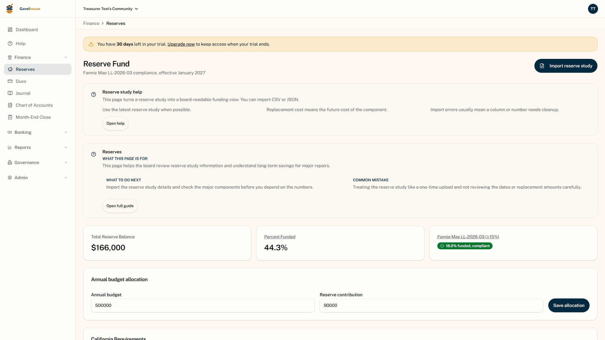
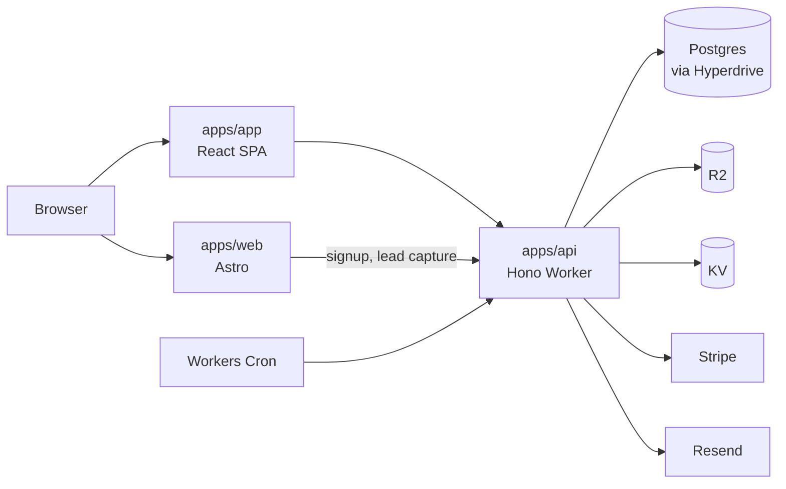
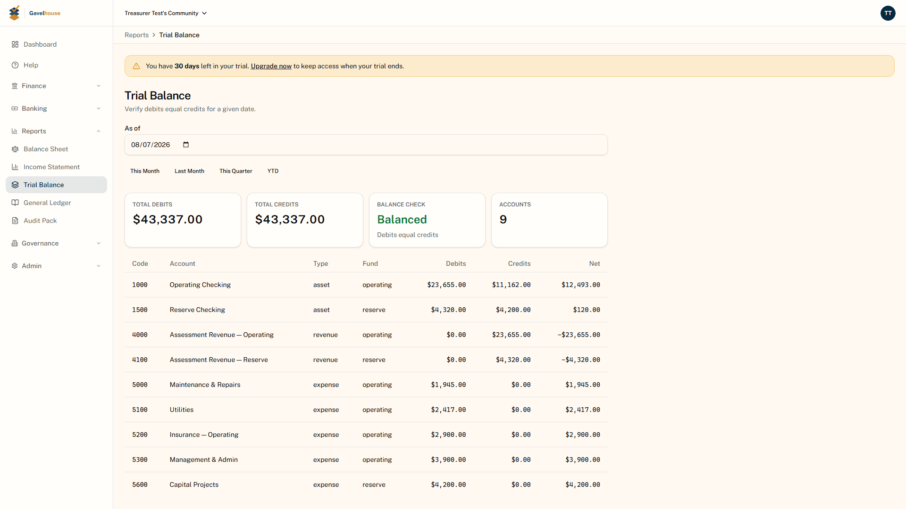
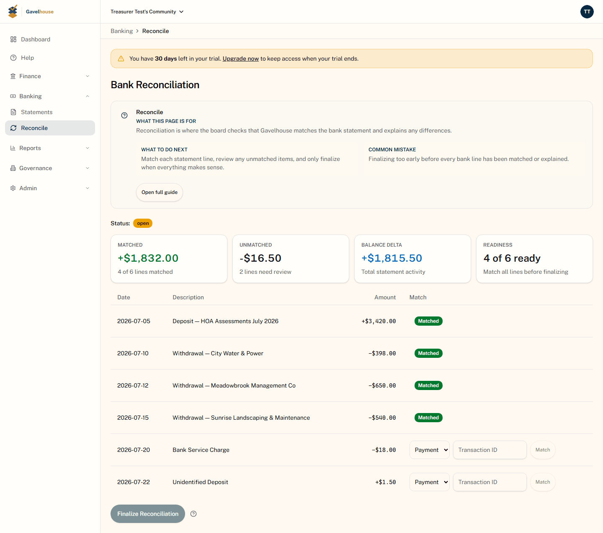
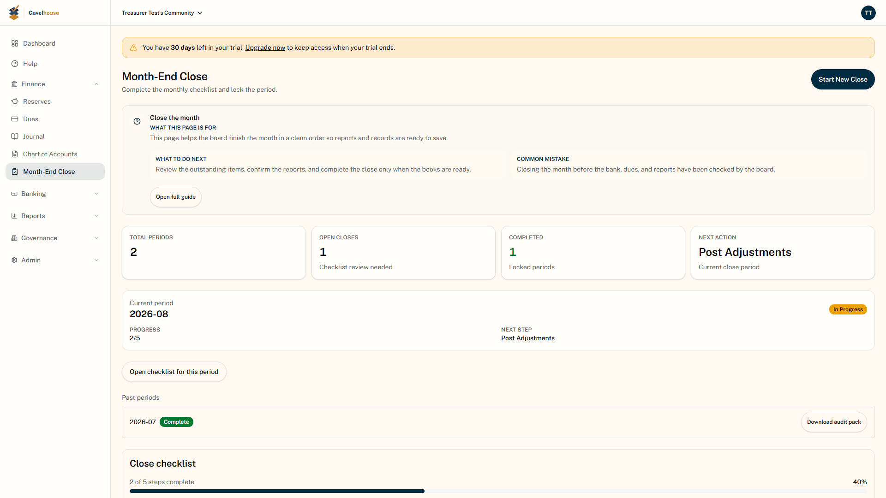
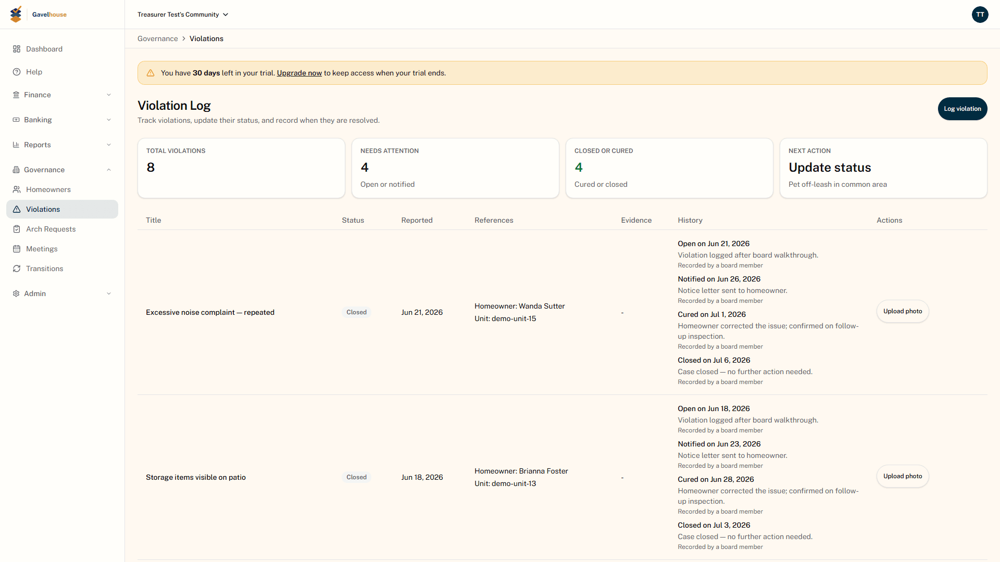
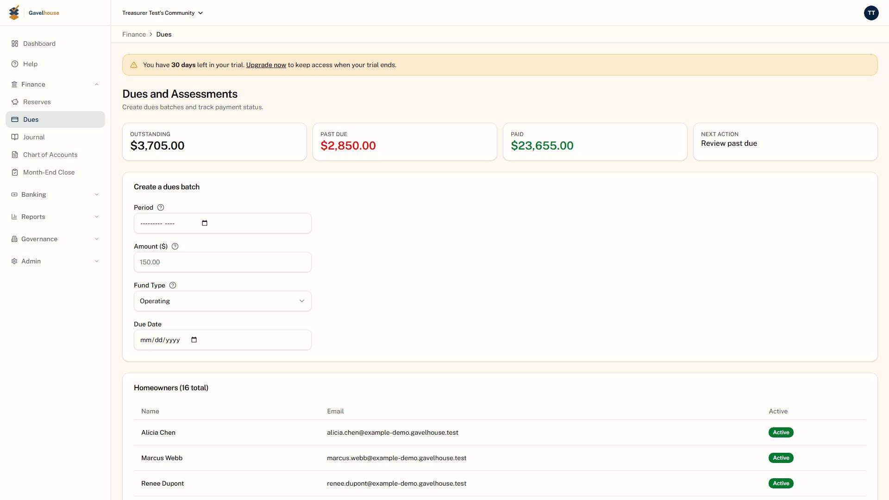

# Gavelhouse

HOA reserve funds are legally separate from operating funds, and QuickBooks
has no structural way to keep them apart. Gavelhouse enforced the separation
in the ledger: every account and journal line carried a `fundType`, and the
one function in the application that wrote to the journal required the
operating and reserve sides to balance _independently_. Around that sat
double-entry accounting, month-end close, bank reconciliation, dues
collection, and governance workflows for the volunteer treasurers and
presidents who run a community without a management company.

> [!IMPORTANT]
> **Status: shut down.** Gavelhouse shipped to production on Cloudflare, ran
> live, and was wound down on 2026-06-11, a decision about time and market.
> The live URLs are gone; this repository is published as the engineering
> record of what was built. Every claim below is checked against the source
> in this tree.
> [`portfolio/METRICS.md`](portfolio/METRICS.md) gives the command behind
> every number.

> [!NOTE]
> Built solo by Angel Campa. Published to be read, not reused: see
> [License](#license). Byline and contact details are in
> [Who built this](#who-built-this).




_The reserve-fund compliance page the product was built around: the balance a
board is tracking, and the Fannie Mae allocation test run against it.
Captured from the local stack against seeded data._

## Contents

- [What it did](#what-it-did)
- [Architecture](#architecture)
- [Notable engineering](#notable-engineering)
- [By the numbers](#by-the-numbers)
- [Testing](#testing)
- [Screenshots](#screenshots)
- [Repository map](#repository-map)
- [Documentation](#documentation)
- [Built with AI agents](#built-with-ai-agents)
- [Running it locally](#running-it-locally)
- [Who built this](#who-built-this)
- [License](#license)

## If you read one thing

[`postEntry.ts`](apps/api/src/domain/accounting/postEntry.ts) is the one
function that posts debits and credits to the ledger, and it enforces a
rule stricter than textbook double-entry: it sums debits and credits
separately for the operating and reserve sides of every journal entry and
throws a dedicated `CommingleError` before either side can cross into the
other. An entry that balances in total but tries to move money between funds
without an explicit contra-entry on each side gets rejected before it
reaches the database, and each line's fund is copied server-side from the
account it references, so a client can't relabel which fund a line belongs
to. That single rule is the product's entire argument against QuickBooks,
which has no structural way to stop the two funds from commingling.
[`ACCOUNTING-ENGINE.md`](portfolio/ACCOUNTING-ENGINE.md) covers the chart of
accounts, the four report generators built as pure reads over that ledger,
and the one place those reports don't fully live up to the invariant yet: a
balance-sheet display gap, scoped and shown unretouched in the screenshots
below.

## What it did

Gavelhouse was built by one person over about eight weeks, from the first
commit on 2026-04-14 to the shutdown on 2026-06-11. It shipped double-entry
accounting with the per-fund invariant above, bank reconciliation, a
month-end close workflow, dues collection through Stripe, governance
workflows for violations, architectural requests, and board meetings, an
owner portal, and a legal rule table of reserve-fund requirements covering
every US state and DC.

The shutdown is enforced in the code that's still here, not just asserted in
this file. The dashboard's entry point renders a closure notice when
`VITE_GAVELHOUSE_SHUTDOWN` is set, which production builds force on: the
deploy script injects it because Vite inlines `VITE_*` variables at build
time and would otherwise ship a live bundle regardless of what this README
says. The API and marketing Workers carry their own `GAVELHOUSE_SHUTDOWN` in
checked-in `wrangler.toml` `[vars]`, and on top of that the API Worker
returns 410 for every request regardless of what the bundle contains. Local
development leaves the flag off and boots the real application. The switch
holds for anything deployed; the code stays runnable for anyone reading it.

This repository is a single-commit export of a private repository, taken at
commit `cbbe917d` on 2026-08-12. It holds the complete working tree and none
of the history. See [By the numbers](#by-the-numbers) for what that costs
and how the figures survive it anyway.

## Architecture

Gavelhouse was a Cloudflare-native monorepo: three deployed applications and
two shared packages, all running on Workers, backed by Postgres.

| Package                              | What it is                                      | Built with                                                       |
| ------------------------------------ | ----------------------------------------------- | ---------------------------------------------------------------- |
| [`apps/app`](apps/app)               | Board dashboard SPA                             | React 19, Vite, TanStack Router, TanStack Query, Tailwind 4      |
| [`apps/api`](apps/api)               | API and background jobs                         | Hono on Cloudflare Workers, Drizzle ORM, Postgres via Hyperdrive |
| [`apps/web`](apps/web)               | Marketing site                                  | Astro 5, 443 content entries across 9 collections                |
| [`packages/shared`](packages/shared) | Zod schemas, constants, compliance tables       | TypeScript                                                       |
| [`packages/design`](packages/design) | Design tokens                                   | CSS custom properties                                            |
| [`scripts`](scripts)                 | Repo tooling: deploy guards, metrics, bootstrap | TypeScript                                                       |
| [`portfolio`](portfolio)             | The engineering write-ups linked below          | Markdown                                                         |

Better Auth for sessions, Stripe for both subscription billing and HOA dues
collection, Resend for transactional email, Cloudflare R2 for evidence and
generated audit packs, KV for rate limiting, D1 for nonces, Workers Cron for
scheduled sweeps, Sentry and PostHog for observability.



→ [`portfolio/ARCHITECTURE.md`](portfolio/ARCHITECTURE.md) has the full
system diagram, the request lifecycle through the middleware chain, the data
model grouped by bounded context, and the deploy pipeline.

[`packages/ai-cs-stub`](packages/ai-cs-stub) shadows the name of
`@ventora/ai-cs`, a private package that powered the AI support widget in
production. The Worker it talked to isn't part of this repository, so the
stub swaps in an inert component with the same name, which is what lets
`pnpm install` run without credentials; the two tests that drove the real
widget's streaming protocol are skipped rather than deleted, with a comment
explaining why.

## Notable engineering

**An audit trail no route handler knows about.** Every mutating request
across six route groups writes an `auditEvents` row (entity type, action,
entity ID, community ID) derived generically from the request path, body,
and response by a single Hono middleware. Zero route handlers call an audit
function, so none can forget to. →
[`AUDIT-LOGGING.md`](portfolio/AUDIT-LOGGING.md)

**Deploys that verify themselves.** A deploy refuses to start on a dirty
tree, off `master`, or out of sync with origin, and refuses to proceed if a
stale Cloudflare project still exists. After `wrangler deploy` returns, it
polls the live URL and compares the commit SHA actually being served against
the one just pushed. Exit code zero is not evidence. The guard behind all of
this, `check-no-raw-wrangler`, scans committed `package.json` files, so it
stops a raw `wrangler deploy` from being codified into a tracked script but
can't catch one typed straight into a terminal. →
[`DEPLOY-PIPELINE.md`](portfolio/DEPLOY-PIPELINE.md#where-the-guard-stops)

**Double-entry accounting that cannot commingle funds.** The per-fund balance
invariant described above, plus the chart of accounts it rests on, the
report layer built over it, and the advisory locks that guard month-end
close. QuickBooks can track the two funds; what it has no structural way to
do is refuse an entry that mixes them. That refusal was the product's entire
argument. → [`ACCOUNTING-ENGINE.md`](portfolio/ACCOUNTING-ENGINE.md)

**Three concurrency problems, three different tools.** An idempotency ledger
for Stripe webhook redelivery, Postgres transaction-scoped advisory locks for
the month-end close sequence, and a KV rate limiter whose author documented
its own race condition and quantified the worst case rather than pretending
it was airtight. →
[`CONCURRENCY-AND-IDEMPOTENCY.md`](portfolio/CONCURRENCY-AND-IDEMPOTENCY.md)

**A mandatory review pass that caught the same tenant-isolation defect six
times before any instance shipped.** The same missing `communityId`
predicate turned up in a `journalLines` read in the Phase 2 review, then
five more times in Phase 4: two `UPDATE` statements, two `SELECT` filters,
and a sixth (`monthEndCloses`) that the review itself labels "Same class as
C-1/C-2." Every instance was found and fixed in the same review cycle it
surfaced in, and none reached production. →
[`ENGINEERING-LOG.md`](portfolio/ENGINEERING-LOG.md)

Also worth a look: a [51-entry legal rule table](packages/shared/src/compliance/states.ts)
(50 states plus DC) of HOA reserve-fund requirements with statute citations,
classified by whether each state mandates, merely requires disclosure of,
permits, or is silent on reserve studies; a
[guard](scripts/lib/public-facts-guard.ts) that scans every tracked text file
for hardcoded prices or URLs that should reference shared constants; and a
[pre-commit hook](scripts/run-affected-checks.ts) that runs lint, typecheck,
and coverage only for the workspaces your staged files actually touch.

## By the numbers

This repository is a single-commit export of a private repository, taken at
commit `cbbe917d` on 2026-08-12. It holds the complete working tree and none
of the history.

The History row below describes that source repository (680 commits from
2026-04-14 to 2026-08-12), not this export, which has one. Those figures are
recorded in [`docs/source-history.json`](docs/source-history.json) and read
from there by the metrics generator, so every other number on this page is
still reproducible with `pnpm run metrics:generate`.

<!-- METRICS:START -->

|               |                                        |
| ------------- | -------------------------------------- |
| Source        | 224,885 lines across 981 files         |
| Tests         | 418 files, at least 6,580 cases        |
| Coverage gate | 95% per file, enforced in 5 workspaces |
| Database      | 42 tables, 27 migrations               |
| API           | 107 endpoints across 36 route files    |
| History       | 680 commits, 2026-04-14 to 2026-08-12  |

<!-- METRICS:END -->

Those numbers are generated by
[`scripts/collect-metrics.ts`](scripts/collect-metrics.ts), not typed by
hand, and `pnpm run metrics:check` fails the build if they drift.

→ [`portfolio/METRICS.md`](portfolio/METRICS.md) gives the full methodology:
what each number counts, what it excludes, and why the endpoint count comes
from Hono's route table instead of a grep.

## Testing

Vitest across every workspace, Playwright for real end-to-end checks and for
the screenshot capture that produced the images below. The coverage gate is
**95% per file** on lines, functions, branches, and statements, not a
repository average, so a well-tested file cannot subsidize an untested one.

```bash
pnpm run verify
```

That runs lint, typecheck, the knowledge-base check, the public-facts guard,
the metrics check, an SEO audit, the raw-wrangler guard, coverage across all
five workspaces, and the repo tooling's own tests.

With no team and no CI on this snapshot, a reviewer subagent and a set of
scripted production sweeps stood in for both functions: recon passes,
per-workspace defect inventories, phase reviews, and dated production bug
reports, kept as written, including the defects that were found and
consciously not fixed. →
[`portfolio/TESTING.md`](portfolio/TESTING.md)

## Screenshots

Everything below is fabricated seed data. See
[`apps/api/scripts/seed-demo.ts`](apps/api/scripts/seed-demo.ts).

<table>
<tr>
<td width="50%">

**Trial balance**



</td>
<td width="50%">

**Bank reconciliation**



</td>
</tr>
<tr>
<td width="50%">

**Month-end close**



</td>
<td width="50%">

**Violation log**



</td>
</tr>
<tr>
<td width="50%">

**Dues**



</td>
<td width="50%">

**Reserve fund compliance**


</td>
</tr>
</table>

The full archive (every dashboard screen at four viewports, dialogs, empty
states, the owner portal, and the marketing site) is in
[docs/screenshots/](docs/screenshots/). It is published unretouched,
including the three rough edges called out in the
[archive index](docs/screenshots/README.md). The six images above are the
curated subset this README actually shows; everything else is working
evidence, not curated proof.

## Repository map

```text
apps/
  api/       Hono Worker API, Drizzle ORM, Postgres via Hyperdrive
  app/       React 19 SPA dashboard (Vite, TanStack Router/Query, Tailwind 4)
  web/       Astro 5 marketing site, 443 content entries across 9 collections
packages/
  shared/    Zod schemas, constants, compliance tables
  design/    Design tokens (CSS custom properties)
  ai-cs-stub/  Inert stand-in for the private AI-support widget package
scripts/     Repo tooling: deploy guards, metrics generation, bootstrap
portfolio/   Retrospective engineering write-ups and curated screenshots
docs/        Working record: runbooks, QA history, full screenshot archive
```

## Documentation

`portfolio/` is retrospective and written for a reader: every claim traces
to a file, every number to the command that produced it. `docs/` is
prospective and written for the author: dated, working residue kept as it
was. → [`portfolio/README.md`](portfolio/README.md) indexes the write-ups,
including [`SECURITY.md`](portfolio/SECURITY.md) for the tenancy, auth,
payments, and secrets posture this product ran with;
[`docs/`](docs/) holds the runbooks, QA history, and the full screenshot
archive behind them.

## Built with AI agents

Gavelhouse was built solo with Claude Code and Codex as the primary
development tooling, under a sub-agent-driven workflow: an orchestrator
decomposed work, delegated bounded tasks to fresh subagents for
exploration, implementation, and review, and kept its own context reserved
for integration. `CLAUDE.md`, `AGENTS.md`, `agents/claude.md`, and `.claude/`
are committed on purpose and reviewed like source, the same as any other file
in this tree. This snapshot has no `.codex/` directory to disclose.

One gate the process actually enforced, not just documented: a dedicated
reviewer subagent was mandatory before any implemented work counted as done,
and it found real defects rather than rubber-stamping. The Phase 4 review
(run with 948 tests passing) still caught two critical cross-tenant
authorization gaps (`UPDATE` statements missing a `communityId` predicate)
and four more important findings, all fixed before merge; the fixes and their
exact file locations are recorded in
[`docs/engineering/qa-history/phase-4-review.md`](docs/engineering/qa-history/phase-4-review.md).
The same review process, run across three workspace-level defect audits,
catalogued 135 findings by severity. See
[`portfolio/TESTING.md`](portfolio/TESTING.md) for the breakdown and for the
one confirmed-fixed critical (a test-environment tier bypass) verified
against the current source, not just against the review that reported it.

## Running it locally

You need Node, pnpm 10.33.0, and Docker.

```bash
pnpm install
cp apps/api/.dev.vars.example apps/api/.dev.vars
cp apps/app/.env.example apps/app/.env
cp apps/web/.env.example apps/web/.env
pnpm run dev:bootstrap
```

That starts Postgres and applies the migrations. Then in one terminal:

```bash
pnpm dev
```

And in another, once the API is up:

```bash
pnpm --filter @boardstack/api run seed:demo
```

Open http://localhost:3060 and sign in as `treasurer@test.gavelhouse.app`
with password `Test1234!`. The dashboard runs on :3060, the marketing site on
:3061, the API on :8060.

Stripe, Resend, Google OAuth, Sentry, and PostHog are all optional: leave
those keys blank and the features degrade quietly. Full walkthrough and
troubleshooting in
[docs/local-development.md](docs/local-development.md).

This cannot be pointed at production. No live credentials are in this
repository, and the deployed Workers are shut down behind a kill switch that
stays on.

## Who built this

Built by Angel Campa, solo, over about eight weeks. Questions about anything
in here are welcome via [github.com/AngelCampa1](https://github.com/AngelCampa1).

## License

All rights reserved. This code is published to be read, not reused. See
[LICENSE](LICENSE). GitHub's Terms of Service still let you view and fork a
public repository; the license restricts what you may do with the code, not
whether you can see it.
