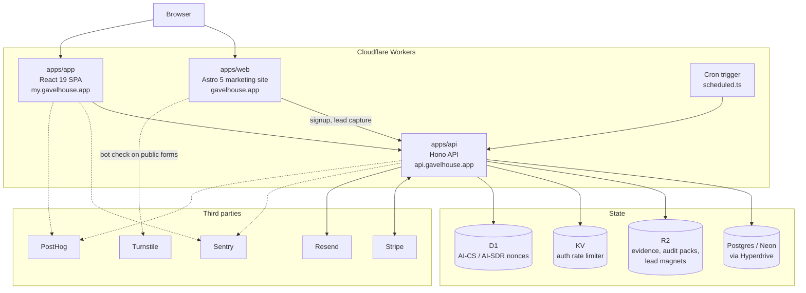
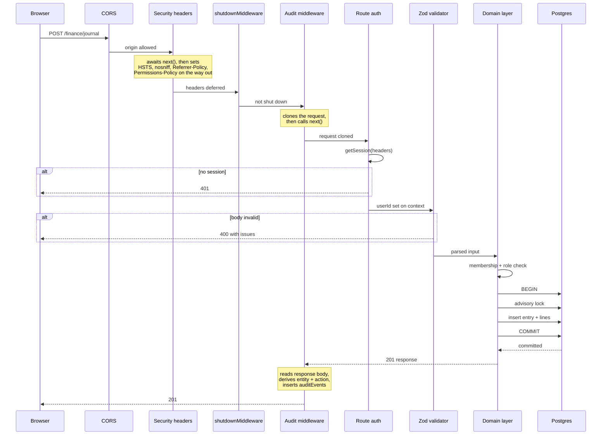
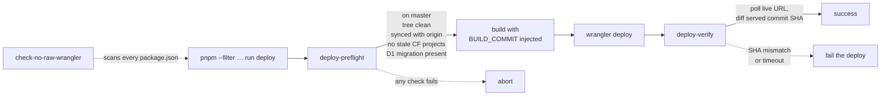

# Architecture

Gavelhouse is a Cloudflare-native monorepo: three deployed applications and two
shared packages, all running on Workers, backed by Postgres.

## System overview



Postgres is the system of record. R2 holds binary artifacts that should not live
in the database: uploaded violation evidence, generated audit-pack archives, and
lead-magnet PDFs. KV backs the auth rate limiter. D1 holds two short-lived nonce
tables for replay protection on the AI support and AI SDR endpoints: a separate
database because the access pattern is write-once, read-once, expire, and it has
no relationship to anything in Postgres.

## Request lifecycle

Every authenticated mutation follows the same path. The order below is the real
middleware registration order in
[`apps/api/src/index.ts`](../apps/api/src/index.ts).



Two things are worth noticing.

The health route is mounted _before_ `shutdownMiddleware`, which is why
`/health` kept answering after the product was taken offline while every other
route returned 410.

The audit middleware wraps the request rather than being called by it. It runs
before `next()` to capture the request, and again after the response is produced
to record what happened. No route handler calls an audit function. See
[AUDIT-LOGGING.md](./AUDIT-LOGGING.md).

## Data model

42 tables, grouped by bounded context. The grouping is conceptual and mostly
lines up with the files under
[`apps/api/src/db/schema/`](../apps/api/src/db/schema/), though not one-to-one:
identity and tenancy spans `tenancy.ts` and `auth.ts`, accounting core spans
`accounts.ts` and `journal.ts`, and the platform group covers seven files.

```mermaid
flowchart TB
  subgraph identity["Identity and tenancy"]
    communities["communities"]
    members["communityMembers"]
    invitations["invitations"]
    authtbl["user · session<br/>account · verification"]
  end

  subgraph acct["Accounting core"]
    accounts["accounts<br/>(chart of accounts)"]
    entries["journalEntries"]
    lines["journalLines"]
  end

  subgraph dues["Dues and ownership"]
    units["units"]
    homeowners["homeowners"]
    ownerships["unitOwnerships"]
    assessments["assessments"]
    payments["payments"]
  end

  subgraph bank["Bank reconciliation"]
    statements["bankStatements"]
    stmtlines["bankStatementLines"]
    recs["reconciliations"]
    matches["reconciliationMatches"]
  end

  subgraph close["Month-end close"]
    closes["monthEndCloses"]
    checklist["closeChecklistItems"]
  end

  subgraph gov["Governance"]
    violations["violations · violationEvents"]
    arch["archRequests"]
    meetings["meetings · motions · votes"]
    portal["ownerPortalSessions"]
    transitions["boardTransitions"]
  end

  subgraph reserve["Reserve studies"]
    studies["reserveStudies"]
    components["reserveComponents"]
  end

  subgraph pf["Portfolio rollup"]
    portfolios["portfolios"]
    pfc["portfolioCommunities"]
  end

  subgraph plat["Platform"]
    subs["subscriptions"]
    stripeev["processedStripeEvents"]
    audit["auditEvents"]
    growth["communityActivation · churnReasons<br/>leads · leadMagnetDownloads<br/>feedbackSubmissions · aiCsEscalations"]
  end

  authtbl --> members
  communities --> members
  communities --> invitations
  communities ==>|communityId| acct
  communities ==>|communityId| dues
  communities ==>|communityId| bank
  communities ==>|communityId| close
  communities ==>|communityId| gov
  communities ==>|communityId| reserve
  communities --> subs
  communities --> audit

  entries --> lines
  accounts --> lines
  assessments --> payments
  units --> ownerships
  homeowners --> ownerships
  statements --> stmtlines
  stmtlines --> matches
  payments --> matches
  closes --> checklist
  studies --> components
  portfolios --> pfc
  communities --> pfc
```



The thick edges are the tenancy boundary: every one of those tables carries a
`communityId`, and every query filters on it.

## Multi-tenancy and authorization

There are three separate gates, and they answer different questions.

**Tenancy**: is this row yours? Every tenant-scoped table carries `communityId`,
and queries filter on it. This is a convention enforced by review rather than by
row-level security in Postgres.

**Role**: are you allowed to do this?
[`apps/api/src/domain/policy/access.ts`](../apps/api/src/domain/policy/access.ts)
resolves the caller's `communityMembers` row and checks their role. Write
operations on the ledger, for example, are restricted to `owner`, `admin`, and
`treasurer`.

**Tier**: does your plan include this?
[`apps/api/src/domain/tier/requireTier.ts`](../apps/api/src/domain/tier/requireTier.ts)
gates features and enforces the seat and home limits attached to each pricing
band.

The portfolio rollup sits above all three. A `portfolios` row groups multiple
communities for a management operator, and access to it requires membership in
every community being rolled up. It is an additional constraint, not a way
around the per-community checks.

## Accounting

The ledger is real double-entry bookkeeping, and the reason is regulatory rather
than aesthetic: HOA reserve funds must not be commingled with operating funds.

Every account carries a `fundType` of `operating` or `reserve`, and the posting
path copies that value onto each journal line rather than trusting the caller.
The balance check is then stricter than textbook double-entry (the two funds
must each balance **independently**):

```ts
// apps/api/src/domain/accounting/postEntry.ts
const opBalanced = opDebit === opCredit;
const resBalanced = resDebit === resCredit;

if (!opBalanced || !resBalanced) {
  throw new CommingleError(
    `Operating and reserve funds must balance independently. Entry rejected to prevent commingling. ...`,
  );
}
```

An entry that debits an operating account and credits a reserve account balances
in total and is still rejected. That single rule is the product's central
argument: QuickBooks, the tool most self-managed boards reach for, cannot
express it.

All writes go through this one posting function. The four reports (trial
balance, balance sheet, income statement, general ledger) are pure reads over
journal lines, so they cannot disagree with the ledger.

Month-end close is a state machine with a checklist, and completing a close is
serialized by a Postgres transaction-scoped advisory lock. See
[ACCOUNTING-ENGINE.md](./ACCOUNTING-ENGINE.md).

## Deploy pipeline



A deploy is not considered successful because `wrangler` exited zero. It is
successful when the live URL serves the commit that was just pushed. See
[DEPLOY-PIPELINE.md](./DEPLOY-PIPELINE.md).

## Further reading

- [AUDIT-LOGGING.md](./AUDIT-LOGGING.md)
- [DEPLOY-PIPELINE.md](./DEPLOY-PIPELINE.md)
- [ACCOUNTING-ENGINE.md](./ACCOUNTING-ENGINE.md)
- [CONCURRENCY-AND-IDEMPOTENCY.md](./CONCURRENCY-AND-IDEMPOTENCY.md)
- [docs/engineering/qa-history/](../docs/engineering/qa-history/): the release-readiness
  process
- [docs/local-development.md](../docs/local-development.md): running it
